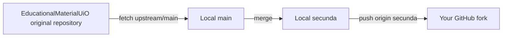

# GitHub Pipeline

## In practice

The original repository is configured as `upstream`:

```text
EducationalMaterialUiO/MachineLearningUiO
```

Your fork is configured as `origin`:

```text
Timholmen96/MachineLearningUiO
```

1. Update local `main` from the original repository:

   ```bash
   git switch main
   git pull upstream main
   ```

2. Merge the updates into your working branch, `secunda`:

   ```bash
   git switch secunda
   git merge main
   ```

3. Push your work to the `secunda` branch on your fork:

   ```bash
   git push origin secunda
   ```

You work and write exercises on `secunda`. The original repository is only used as a source of updates. You do not need to push `main` to your fork.



The GitHub Pages workflow runs when `main` receives a push. Pushing `secunda` updates your fork's working branch but does not trigger that deployment workflow.
